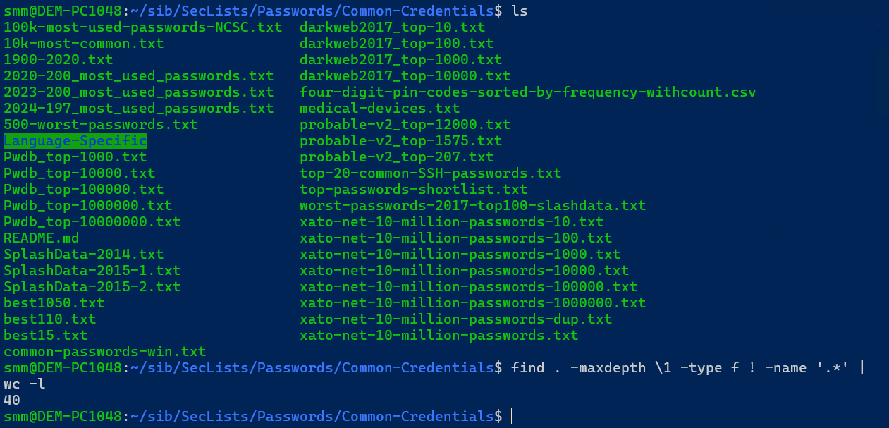
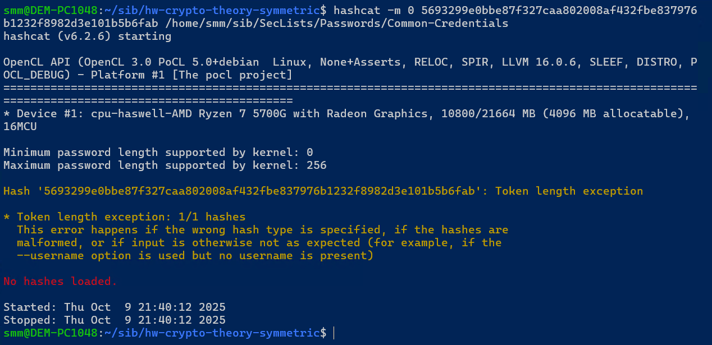
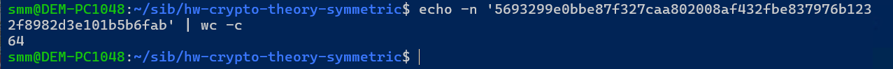
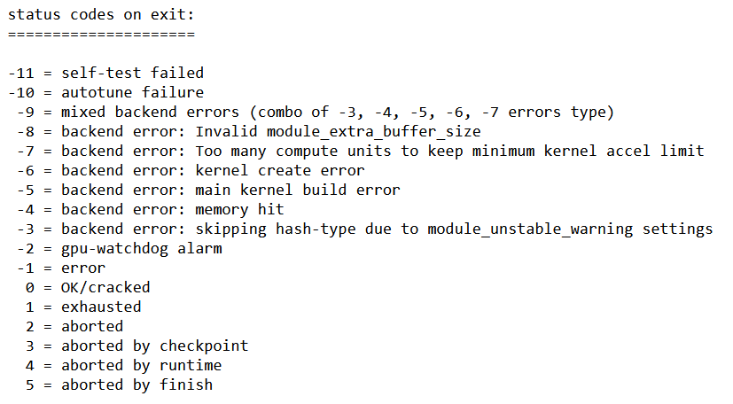
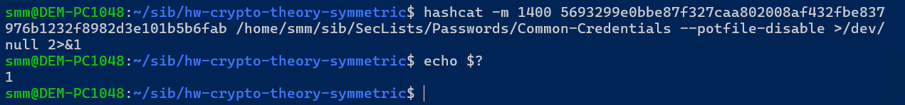
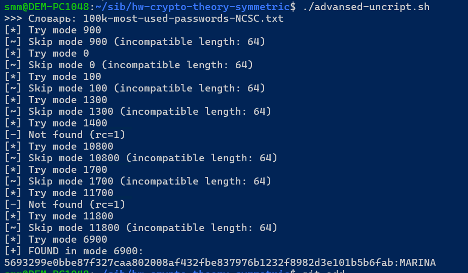
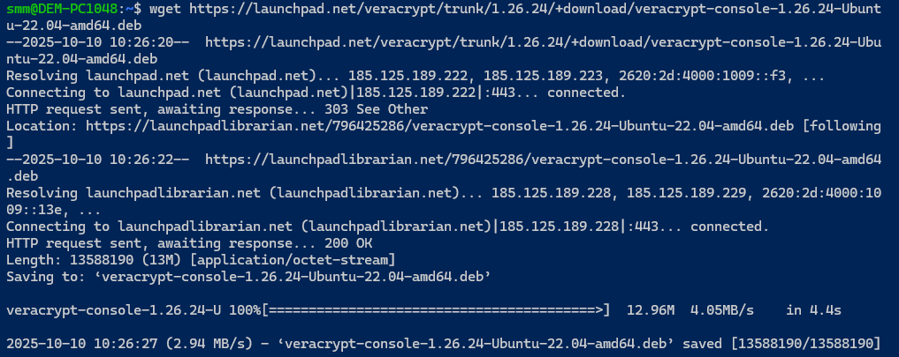
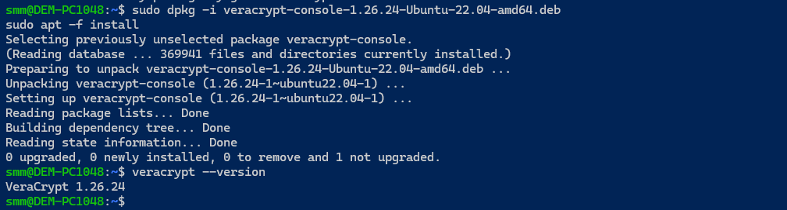
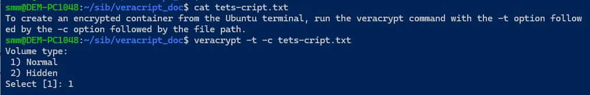
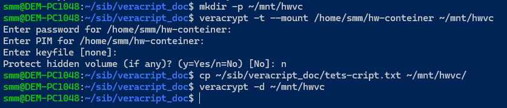

# Домашнее задание к занятию «3.1. Теоретические основы криптографии, симметричные криптосистемы»- Михалёв Сергей

## Задача №1 - HashCat


Каким-то образом у вас оказался хэш пароля. Вот такой: `5693299e0bbe87f327caa802008af432fbe837976b1232f8982d3e101b5b6fab`.

Что нужно сделать: вам нужно попробовать по длине хэша угадать его тип (это будет один из тех, что упоминался на лекции, как минимум, в табличке в конце лекции).

<details>
<summary>Подсказка</summary>
  
Обратите внимание, мы не просто так говорим про длину.
</details>

<details>
<summary>Использование hashcat</summary>

Запустить hashcat для подбора пароля можно в следующем формате:

`hashcat -m <X> 5693299e0bbe87f327caa802008af432fbe837976b1232f8982d3e101b5b6fab wordlist.txt`

Где `<X>` это тип хэша, в соответствии с таблицей (т.е. для GOST R 34.11-2012 (Streebog) 256-bit, big-endian будет `11700`):

|     # | Name                                             | Category                            |
|-------|--------------------------------------------------|-------------------------------------|
|   900 | MD4                                              | Raw Hash                            |
|     0 | MD5                                              | Raw Hash                            |
|   100 | SHA1                                             | Raw Hash                            |
|  1300 | SHA2-224                                         | Raw Hash                            |
|  1400 | SHA2-256                                         | Raw Hash                            |
| 10800 | SHA2-384                                         | Raw Hash                            |
|  1700 | SHA2-512                                         | Raw Hash                            |
| 11700 | GOST R 34.11-2012 (Streebog) 256-bit, big-endian | Raw Hash                            |
| 11800 | GOST R 34.11-2012 (Streebog) 512-bit, big-endian | Raw Hash                            |
|  6900 | GOST R 34.11-94                                  | Raw Hash                            |

А `wordlist.txt` - файл с самыми распространёнными паролями. Набор таких файлов вы можете найти по адресу https://github.com/danielmiessler/SecLists/tree/master/Passwords/Common-Credentials.

Т.е. мы собираемся осуществить атаку по словарю.

Мы рекомендуем вам использовать [`Common-Credentials/10-million-password-list-top-100000.txt`](https://gitlab.com/kalilinux/packages/seclists/-/blob/kali/master/Passwords/Common-Credentials/10-million-password-list-top-100000.txt).

</details>

---

## Решение.

Пароль: `MARINA`</br>
Соответсвие хешу пароля было найдено в *100k-most-used-passwords-NCSC.txt*. </br>
Модель хеширования: *GOST R 34.11-94*.

<details>
<summary>Детали решения задания</summary>

После клонирования репозитория [SecLists](https://github.com/danielmiessler/SecLists) получаем достаточно обширную (40 документов) бибилотеку файлов с общепринятыми паролями. </br>


Согласно рекомендации задания и в соответсвии с примером на занятии делаю попытку подобрать пароль используя файл Common-Credentials/10-million-password-list-top-100000.txt предполагая тип хеширования MD5.</br>


Узнаём длину хеша. 64 символа или 256 бит</br>


В [документации к приложению](https://cocalc.com/github/hashcat/hashcat/blob/master/docs/exit_status_code.txt) находим список кодов возврата, так что можнопросто проверить результат (это позже пригодится).</br>




Не выходит. Но вспоминаем программирование на bash, и ипшем скрипт [uncript.sh](uncript.sh).

Создаём список "модов" (методов хешированиря):
```bash
modes=(
  "900"     
  "0"      
  "100"     
  "1300"   
  "1400"    
  "10800"  
  "1700"  
  "11700"   
  "11800"  
  "6900"   
)
```
Далее циклом `for`перебираем все моды.

Результат- пароль `MARINA`.</br>


Здесь код возврата 255 появляется там, где длина хэша не подходит выбранному режиму (hashcat выдаёт “Token length exception”). Это учтено [в улучшеном варианте](advansed-uncript.sh).

Ничто не помешает использовать цикл для всех файлов в директории `SecLists/Passwords/Common-Credentials`. Но эта процедура займёт уйму времени.

Дополднения в коде:
 *  `rule="/usr/share/hashcat/rules/best64.rule" ` для мутаций (MARINA из marina);
 * соответсвенно `-O` и правило для мутаций добавлено в функцию сканирования;
 * изменил правилла определения успеха: определяем только по появлению строки `hash:plain` в `outfile` (не будем доверять только коду возврата);
 * добавил `trap`;
 * добавил функцию `on_err()` для завершения функции.



</details>

-----

## Задача №2 - VeraCrypt

### Справка 

[VeraCrypt](https://www.veracrypt.fr/en/Home.html) - Open Source ПО для шифрования дисков.

Позволяет делать достаточно много вещей, но нас будет интересовать одна ключевая функция: возможность создать виртуальный зашифрованный диск и "подключать" к вашей ОС, при этом все операции чтения/записи с этого диска будут происходить прозрачно для пользователя.

[Скачать VeraCrypt](https://www.veracrypt.fr/en/Downloads.html) можно с официальной страницы (не качайте из неизвестных источников).

### Задача
Отправьте контейнер и пароль к нему в ЛК пользователя.

---

##  Решение

[Ссылка на контейнер](hw-conteiner).

<details>
<summary>Детали решения задания</summary>

Установка приложения VeraCrypt.






<details>
<summary>Создание контейнера, содержащего файл `tets-cript.txt`</summary>


```
$ veracrypt -t -c /home/smm/hw-conteiner
Volume type:
 1) Normal
 2) Hidden
Select [1]: 1

Enter volume size (sizeK/size[M]/sizeG.sizeT/max): 1M

Encryption Algorithm:
 1) AES
 2) Serpent
 3) Twofish
 4) Camellia
 5) Kuznyechik
 6) AES(Twofish)
 7) AES(Twofish(Serpent))
 8) Camellia(Kuznyechik)
 9) Camellia(Serpent)
 10) Kuznyechik(AES)
 11) Kuznyechik(Serpent(Camellia))
 12) Kuznyechik(Twofish)
 13) Serpent(AES)
 14) Serpent(Twofish(AES))
 15) Twofish(Serpent)
Select [1]: 1

Hash algorithm:
 1) SHA-512
 2) SHA-256
 3) BLAKE2s-256
 4) Whirlpool
 5) Streebog
Select [1]: 1

Filesystem:
 1) None
 2) FAT
 3) Linux Ext2
 4) Linux Ext3
 5) Linux Ext4
 6) NTFS
Select [2]: 2

Enter password:
WARNING: Short passwords are easy to crack using brute force techniques!

We recommend choosing a password consisting of 20 or more characters. Are you sure you want to use a short password? (y=Yes/n=No) [No]: y

Re-enter password:

Enter PIM:

Enter keyfile path [none]:

Please type at least 320 randomly chosen characters and then press Enter:


Done: 100.000%  Speed: 344 KiB/s  Left: 0 s

The VeraCrypt volume has been successfully created.
```
</details>



Монтирование [контейнера](hw-conteiner), запись файла, размонтирование контейнера.



Монтирование [контейнера](hw-conteiner), проверка содержимого файла.


</details>